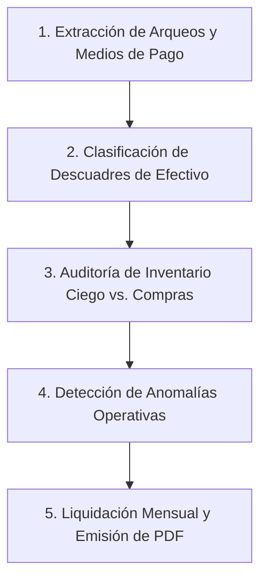

# POS - Auditoría Integral de Turnos, Inventario y Cierre Mensual (Multi-Sucursal)

Este skill proporciona la metodología rigurosa, herramientas automatizadas y scripts para auditar jornadas completas o cierres mensuales de operaciones en cualquiera de las sucursales del sistema POS, detectando:
1. Faltantes reales de efectivo injustificados vs. salidas de caja declaradas informalmente en comentarios.
2. Pérdidas físicas crónicas en inventarios de relevo ciego, descartando falsas alarmas por desfase de compras/ingresos de mercadería.
3. Desvío de procedimientos operativos (carga masiva de ventas en bloque al cierre, omisión del módulo de egresos).
4. Generación de informes formales en PDF listos para retención o liquidación de sueldos.

---

## 🏢 Mapa de Sucursales y Cajas

| ID Sucursal | Nombre Sucursal | Cajas Asociadas | Usuarios Predeterminados |
| :---: | :--- | :--- | :--- |
| **1** | `JOKER MEGA` | Caja 1 (`CAJEROTARDE`), Caja 2 (`CAJERO NOCHE`) | `CAJEROTARDE`, `CAJERONOCHE`, `ADMINMEGA` |
| **2** | `JOKER CENTRAL` | Caja 9 (`JOKER TARDE`), Caja 10 (`JOKERNOCHE`), Caja 11 (`ADM`) | `JOKERTARDE`, `JOKERNOCHE`, `ADMINJOKER` |
| **3** | `JOKER ULTRA` | Caja 5 (`ULTRATARDE`), Caja 6 (`ULTRANOCHE`) | `ULTRATARDE`, `ULTRANOCHE`, `ADMINULTRA` |
| **4** | `JOKER EXPRESS` | Caja 3 (`CAJEROTARDE`), Caja 4 (`CAJERONOCHE`) | `EXPRESSTARDE`, `EXPRESSNOCHE`, `ADMINEXPRESS` |

---

## 🛠️ Herramienta Automatizada de Auditoría

El skill cuenta con el script ejecutable:
```bash
php .agents/skills/pos-auditoria-turnos/scripts/auditar_rango.php <codsucursal|all> <fecha_inicio> <fecha_fin> [--pdf]
```

### Ejemplos de Uso:
```bash
# Auditar Sucursal Ultra para el período mensual con generación de PDF:
php .agents/skills/pos-auditoria-turnos/scripts/auditar_rango.php 3 2026-08-16 2026-09-12 --pdf

# Auditar Joker Central mes de agosto completo:
php .agents/skills/pos-auditoria-turnos/scripts/auditar_rango.php 2 2026-08-01 2026-08-31

# Auditar todas las sucursales a la vez:
php .agents/skills/pos-auditoria-turnos/scripts/auditar_rango.php all 2026-08-01 2026-08-31
```

---

## 📐 Metodología Forense en 5 Pasos



---

### Paso 1: Auditoría de Cierres de Caja (`arqueocaja`) y Pagos (`mediospagoxventas`)
Para cada arqueo en el período:
- Contrastar el total facturado en **Efectivo** vs. **QR** con `efectivocaja` y `dineroefectivo`.
- Calcular la diferencia neta: `diferencia = dineroefectivo - efectivocaja`.
- Si `diferencia < 0`, auditar el campo `comentarios`.

---

### Paso 2: Clasificación Rigurosa de Descuadres de Efectivo
Nunca reportar el faltante total como una sola bolsa. Separar obligatoriamente en dos categorías:

1. **Faltantes Netos Injustificados (Deducción directa de nómina)**:
   - Turnos donde `diferencia < 0` y el campo `comentarios` está vacío o no especifica destino del dinero.
   - Representa pérdida física líquida que debe ser asumida por el cajero responsable.
2. **Salidas de Dinero Declaradas en Comentarios (Cruce con planilla/nómina)**:
   - Notas manuscritas en el cierre tales como: *"SE PAGO PERSONAL 300BS"*, *"PAGO REEMPLAZO YESSICA MESERA"*, *"ADELANTO"*.
   - **Protocolo:** Validar si existen recibos firmados y verificar que el importe conste en las planillas de sueldos de las personas que lo recibieron para **evitar pagar dos veces**.

---

### Paso 3: Control de Inventario Ciego (`conteo_inicial_diario`) y Cruce con Compras
Al analizar las diferencias en `detalle_conteo_inicial`:

1. **Descarte de Falsas Alarmas por Desfase de Facturación vs. Descarga:**
   - Si un conteo arroja un faltante masivo de un producto (ej: -120 unidades):
   - **Regla Obligatoria:** Consultar la tabla `compras` de esa sucursal en fechas cercanas (`fechaemision` / `fecharecepcion`).
   - Si se registró una compra por esa misma cantidad antes de que el lote fuera ubicado en bodega o vitrina, y en el conteo posterior cuadra al 100%, **descartar el faltante** (es un desfase temporal de recepción, no un robo).
2. **Detección de Conteos Omitidos:**
   - Si un producto cae a 0 físico un día y al día siguiente vuelve a su stock normal sin compras ni ajustes, el cajero omitió el conteo físico ese día por descuido.
3. **Faltantes Físicos Crónicos (Mermas Reales):**
   - Si la diferencia negativa se repite sistemáticamente día tras día (ej: -3 Coca Kollitas o -3 pares de guantes de forma continua), cuantificar la pérdida:
     * Al Costo: `abs(diferencia) * preciocompra`
     * A Precio de Venta: `abs(diferencia) * precioxpublico`

---

### Paso 4: Detección de Anomalías Operativas ("Cosas Raras")
Analizar patrones que comprometan la seguridad de la información:

1. **Carga en Bloque al Cierre de Turno:**
   - Comparar la hora de apertura y cierre: `TIMESTAMPDIFF(MINUTE, fechaapertura, fechacierre)`.
   - Si la caja dura abierta menos de 45 minutos y acumula todas las ventas del turno cargadas en 5 a 15 minutos, el personal opera fuera del sistema en papel y hace un "vaciado" al final.
2. **Uso Nulo del Módulo de Egresos:**
   - Si `movimientoscajas` tiene 0 registros para la sucursal pero los cierres reportan pagos a personal en comentarios, instruir formalización inmediata del procedimiento.
3. **Turnos Abiertos Olvidados:**
   - Identificar arqueos con `statusarqueo = 1` o `fechacierre = '0000-00-00 00:00:00'` que acumulen ventas sin corte.

---

### Paso 5: Liquidación para Pago Mensual y Generación de PDF
Estructurar el dictamen de pago en tres componentes claros:

1. **Monto a Descontar al Cajero (Faltante Efectivo + Mercancía al Costo).**
2. **Monto a Verificar en Planillas de Personal (Salidas declaradas para sueldos/reemplazos).**
3. **Emisión de PDF Oficial con FPDF:**
   - Usar el script `scripts/generar_pdf_auditoria_ultra.php` (o la opción `--pdf` de `auditar_rango.php`) para entregar al usuario el documento listo para impresión, firma de gerencia y descargo del trabajador.
